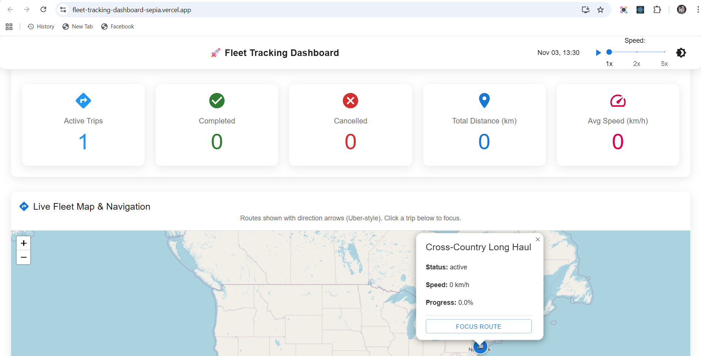

# 🚛 Fleet Tracking Dashboard

A real-time fleet monitoring dashboard built with **React**, **Material-UI**, and **Leaflet**. Visualizes **5 concurrent US trips** with progress bars, alerts, and interactive maps 

## 🌐 [Live Demo](https://fleet-tracking-dashboard-sepia.vercel.app/)

## 🛠️ Tech Stack
- **Frontend**: React 18, Material-UI (MUI) for responsive UI
- **Mapping**: Leaflet for interactive maps with custom markers & polylines
- **Data Processing**: Moment.js for timestamps; efficient filtering for 10k+ events
- **Build**: Create React App; deploys to Vercel/Netlify

## 📋 Prerequisites
- Node.js (v18+): [Download here](https://nodejs.org)
- Git: For cloning the repo

## 🚀 Setup & Run Locally
1. **Clone & Navigate**:
git clone https://github.com/vivek20Eng/Fleet-Tracking-Dashboard.git
cd fleet-tracking-dashboard

2. **Install Dependencies**:
npm install

- Installs React, MUI, Leaflet, Moment, etc. 

4. **Start Development Server**:
npm start

- Opens http://localhost:3000.
- Hot-reloads changes; Ctrl+C to stop.

5. **Build for Production**:
npm run build

## 🎮 How to Use Guide

### Quick Tour
1. **Dashboard Overview**: Top bar with simulation time, ▶️ play/pause (starts at **5x speed**), speed slider (1x/2x/5x), and dark/light mode toggle.
2. **Fleet Metrics**: Icon cards for active/completed/cancelled trips, total distance, avg speed – quick status glance.
3. **Live Map**: US-wide interactive map with custom vehicle markers and colored routes. ▶️ Fab (top-right) fits all; zoom/pan freely.

### Step-by-Step Usage
- **Start Simulation**: Click ▶️ – timestamps advance; progress bars fill, markers move along paths (all 5 trips concurrent/active).
- **Adjust Playback**: Slider for speed; pause to freeze and inspect.
- **Focus a Trip**: 
- Click card's route button or map popup's "Focus Route" – map zooms to path (solid line, dashed for others), expands card details.
- Expand card arrow for current position, speed, and last 5 events (e.g., "location_ping at 10:05").
- **Handle Alerts**: Red chips for issues (overspeed, low fuel, signal lost); fleet banner for totals.
- **Mobile**: Pinch-zoom map; tap cards – fully responsive.

## 📱 Screenshots

| Overview                  | Map Focus                | All Trips                | Trip Details             |
|---------------------------|--------------------------|--------------------------|--------------------------|
|  |  |  |  |

## 🎯 Use Cases
- **Live Monitoring**: Track 5+ vehicles in real-time for dispatchers (progress, speeds, positions).
- **Alert Response**: Instant notifications for overspeed/fuel low; reduce downtime (e.g., reroute cancelled trips).
- **Analytics**: Fleet KPIs (distance, avg speed) for managers; drill-down for efficiency insights.
- **Navigation**:  zoom to routes; verify paths for technical/troubleshooting trips.
- **Mobile Ops**: Field teams check ETAs on-the-go; scalable for larger fleets.

---